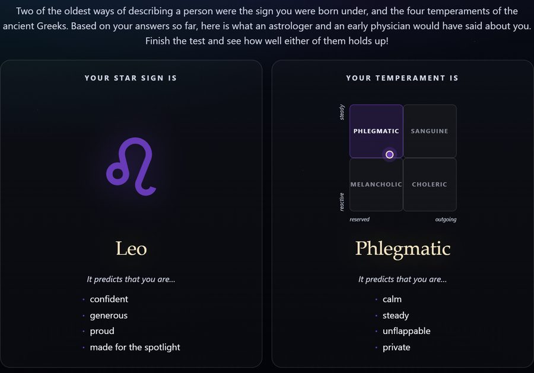
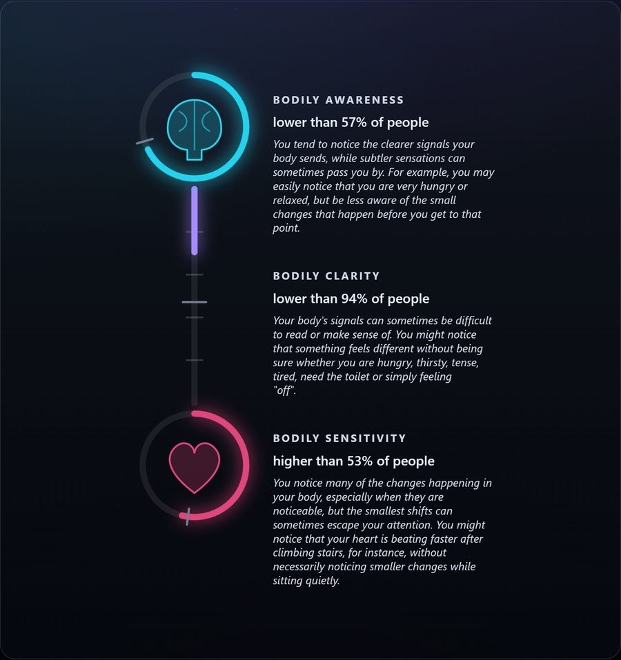
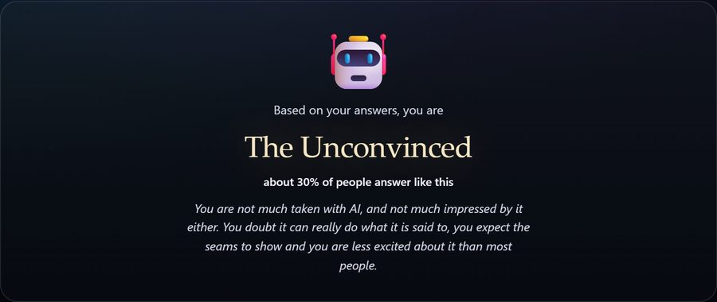
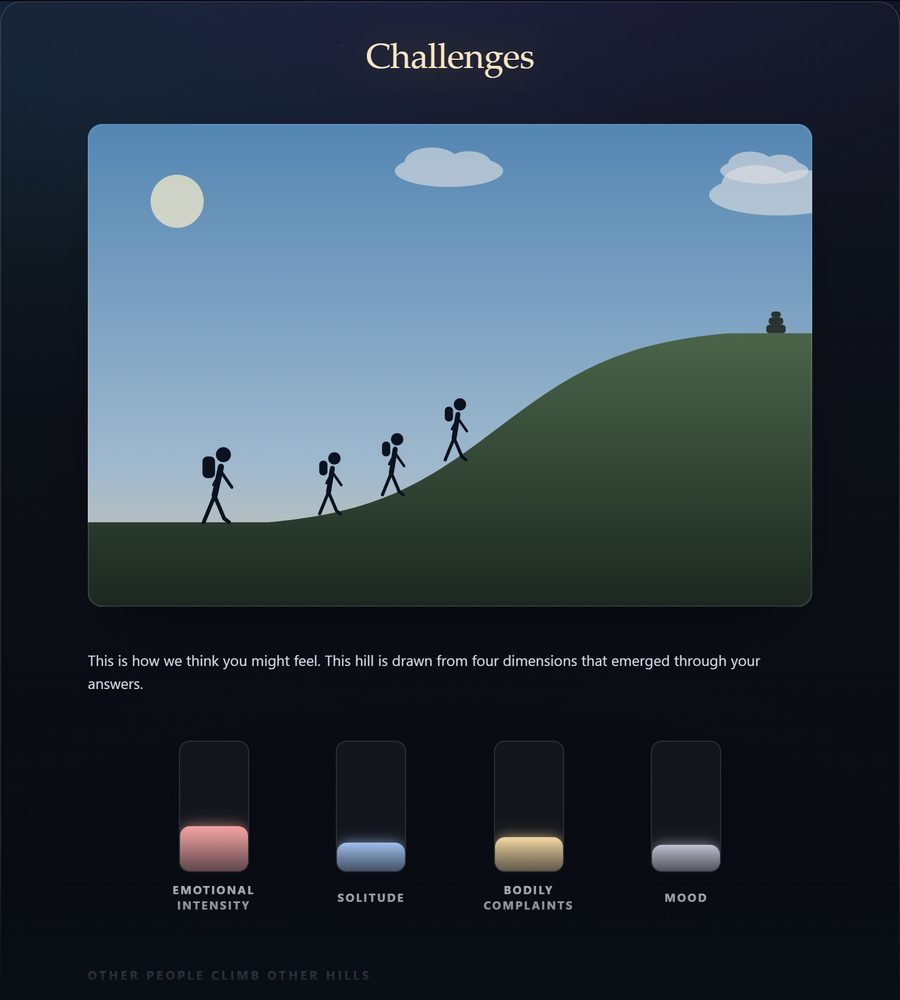
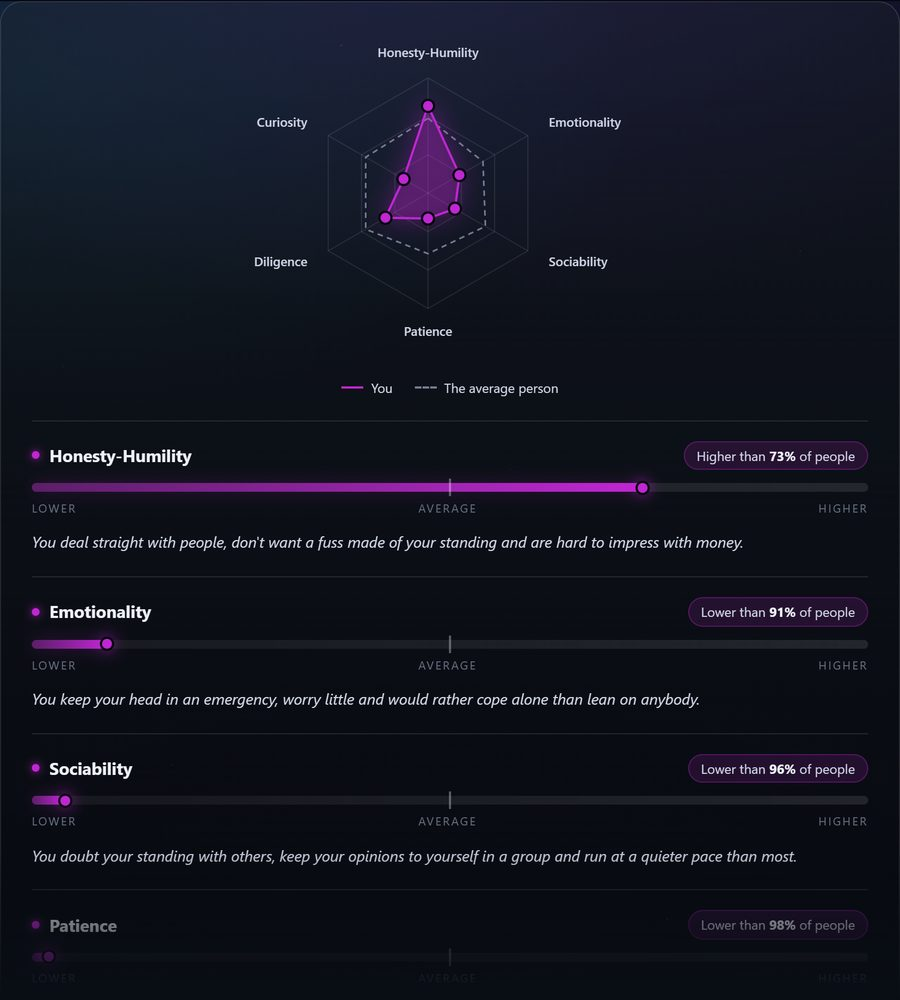
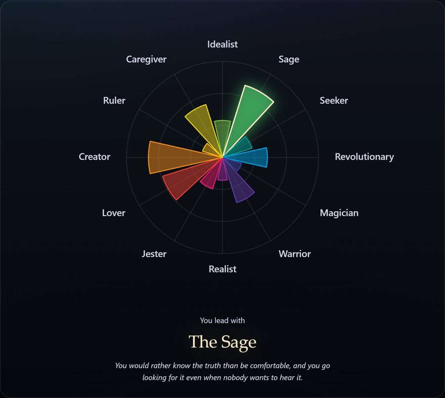
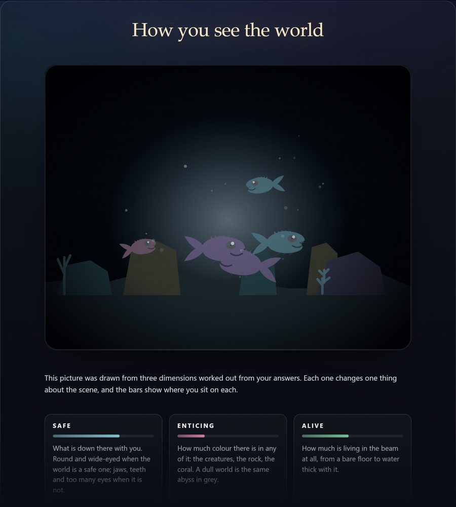
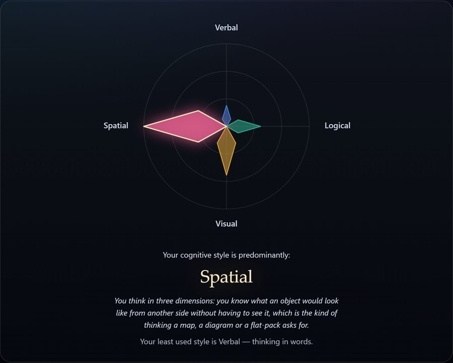
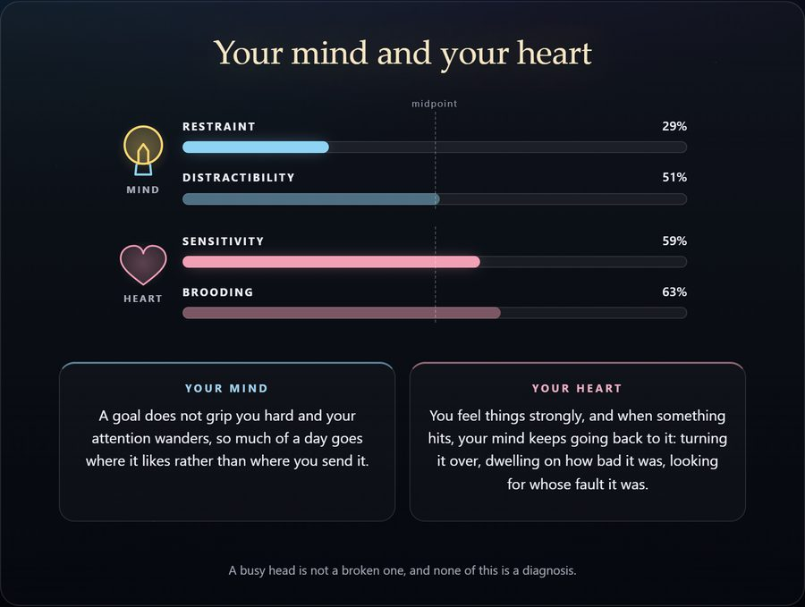
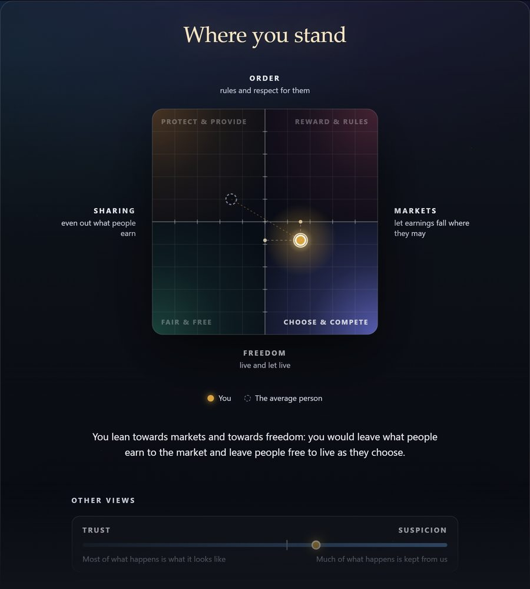

# The Abyss Test

The big dispositional characteristics survey.

## Levels

Every level closes on results of its own. Each link below starts the test on that level, and the rest of the run follows (see `?start=` under [Batteries](#batteries)).

<table>
  <tr>
    <td align="center" width="50%">
      <b>General</b> 
       
      <a href="https://realitybendinglab.com/TestYourself/?source=README"><b>Take the Star Sign Test!</b></a>
    </td>
    <td align="center" width="50%">
      <b>Brain-Body Axis</b> 
       
      <a href="https://realitybendinglab.com/TestYourself/?start=demographics2&amp;source=README"><b>Take the Body Awareness Test!</b></a>
    </td>
  </tr>
  <tr>
    <td align="center" width="50%">
      <b>AI Expertise &amp; Usage</b> 
       
      <a href="https://realitybendinglab.com/TestYourself/?start=bait&amp;source=README"><b>Take the AI Test!</b></a>
    </td>
    <td align="center" width="50%">
      <b>Mood &amp; Health</b> 
       
      <a href="https://realitybendinglab.com/TestYourself/?start=demographics3&amp;source=README"><b>Take the Wellbeing Test!</b></a>
    </td>
  </tr>
  <tr>
    <td align="center" width="50%">
      <b>Character</b> 
       
      <a href="https://realitybendinglab.com/TestYourself/?start=hexaco&amp;source=README"><b>Take the Personality Test!</b></a>
    </td>
    <td align="center" width="50%">
      <b>Archetypes</b> 
       
      <a href="https://realitybendinglab.com/TestYourself/?start=archetypes&amp;source=README"><b>Take the Archetype Test!</b></a>
    </td>
  </tr>
  <tr>
    <td align="center" width="50%">
      <b>The World</b> 
       
      <a href="https://realitybendinglab.com/TestYourself/?start=primals&amp;source=README"><b>Take the Worldview Test!</b></a>
    </td>
    <td align="center" width="50%">
      <b>How You Think</b> 
       
      <a href="https://realitybendinglab.com/TestYourself/?start=icar&amp;source=README"><b>Take the Thinking Style Test!</b></a>
    </td>
  </tr>
  <tr>
    <td align="center" width="50%">
      <b>Mind &amp; Heart</b> 
       
      <a href="https://realitybendinglab.com/TestYourself/?start=regulation&amp;source=README"><b>Take the Mind &amp; Heart Test!</b></a>
    </td>
    <td align="center" width="50%">
      <b>Where You Stand</b> 
       
      <a href="https://realitybendinglab.com/TestYourself/?start=opinions&amp;source=README"><b>Take the Political Test!</b></a>
    </td>
  </tr>
</table>

The pictures are drawn from stand-in scores, not anybody's answers, by `assets/readme/make.py`; rerun it when a figure changes.

## Includes

What the test currently asks — every questionnaire, its reference and its
dimensions — is the **Content** slide of [the documentation deck](docs/index.html),
which is where that table now lives. Open `docs/index.html`; it needs nothing
installed. **Adding, removing or renaming anything in `content/` means updating
it in the same breath.**

## Batteries

A study may ask a subset of the blocks above: `?battery=<name>` in the link picks one of the presets in `content/timeline.js` (`?only=` and `?skip=` list blocks by hand, for testing). The closing items are always asked.

| Battery       | Blocks                                                          |
| ------------- | --------------------------------------------------------------- |
| *(none)*      | Everything in the Includes table, in order                      |
| `personality` | demographics1, fipi, singles, demographics2, hexaco, archetypes |
| `ai`          | demographics1, demographics2, bait                              |

`?source=<text>` says where the link was handed out (a project, an experimenter, a page it was posted on). It is saved in the file and put in its name, `<date>_<source>_<participant>.json`, so that a deposit sorts by date and one study's files can be picked out. Every real deployment should name one: a run without it is saved as `Unknown`, which is worth a second look. The links below carry `source=README`.

`?start=<block>` puts the level holding that block first, and the rest of the run follows in its usual order. For example, to open on the opinions level (Where You Stand):

https://realitybendinglab.com/TestYourself/?start=opinions&source=README

It only reorders and never adds a block, so it combines with the others: https://realitybendinglab.com/TestYourself/?battery=test&start=regulation&source=README asks the `test` battery with Mind & Heart first, and https://realitybendinglab.com/TestYourself/?test=true&start=opinions&source=README gets to the opinions results quickly.

Test mode walks the run in miniature (one item per questionnaire, the rest answered at random) and is not data. There is no button for it on the page; it is reached by the link alone: https://realitybendinglab.com/TestYourself/?test=true&source=README

## Questionnaire Ideas

// Coping

// Being funny, dark humor
// Wordsum: g-factor loaded https://x.com/cremieuxrecueil/status/2098586478443901419?s=20

// Hormones
- For females, add questions about menstrual cycle phase and contraceptive use. Also add question about last sexual activity. These questions need to be accompanied by a mention of why we are asking them (and the possibility to skip them). Explaining that our conscious experiences are shaped by our hormonal state which influences cognition and emotion.

// Sleep

// Parasomnias/boundary failures (IOWA/MPS): TODO ASK GIULIA ABOUT VALIDATION OF HER SCALE
// Sleep health (SATED)
// Dreams (DIQ)
// Daytime sleepiness (ESS)

// Family/Work

// Relationship status/satisfaction
// Dependents
// Occupation (and current job satisfaction)
// Sexual orientation (Kinsey scale?)
// WHO scales have stuff that taps into lots of life domains including sex life satisfaction – quite short I think

// Self vs. others

// Attachment style
// Empathy
// Peri-personal space (we created an avatar thingy for this a while back)
// Public/private self-consciousness
// Shame/disgust
// Social connection

// Wellbeing/emotions

// Self-Rated Health
// Dimorphous emotions
// Mattering
// Wisdom
// Aesthetic experiences

// Relationship with AI (for the `bait` block; the "AI psychosis" reports describe a spiral that starts with a bond and ends in revelation, so measure the stages rather than the outcome)

// Two facets on the BAIT's own 0-6 scale, gated behind BAIT_Usage above "Never", under a key prefix of their own, scored without norms and fed back nowhere
// Relationship: I have felt closer to an AI than to most people I know / I would rather talk something through with an AI than with a person / I feel a sense of loss when a conversation with an AI ends or its memory is reset / I talk about things with AI that I don't talk about with people close to me / I have kept how much I talk to AI from the people close to me
// Revelation: I have developed ideas with an AI that I have not been able to share with anyone in my life / AI makes real breakthroughs about the nature of the world accessible to anyone / Through AI, I have come to understand things about myself and the world that most people never will
// The roles people give their chatbot (companion, friend, therapist, romantic partner, sexual partner) as one tick-any-number item, after Buck & Maheux (2026, JMIR), whose GAATES items ("AI helps me make sense of secret messages intended only for me", "I've discovered hidden truths about the world through AI") are the clinical end of the same ground

// Sensory and cognitive

// Imagery (across sensory modalities – short version of PSIQ)
// Sensory sensitivity (esp. visual – this predicts everything!)
// Obsessive compulsive beliefs (perfectionism, intolerance of uncertainty, control of thoughts)
// Cross-modal correspondences
// Paranormal beliefs
// Unusual sensory experiences
// Fantasy proneness
// Psychotic experiences
// Rumination/worry
// Abstract vs. concrete construal

// political ideology

// https://taketest.xyz/
// Words Can Harm Scale (WCHS)
// Nietzscheanism

Synthetic data
- https://openrouter.ai/
- https://github.com/browser-use/browser-use
- https://pypi.org/project/surveyshield-py/0.2.0/
- https://survey-shield.com/